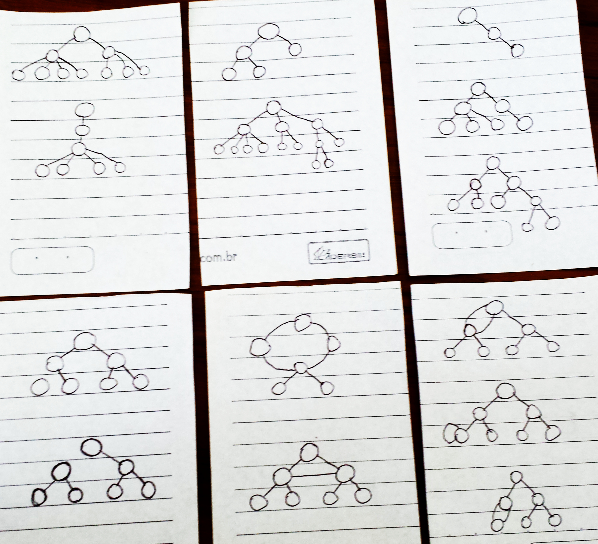
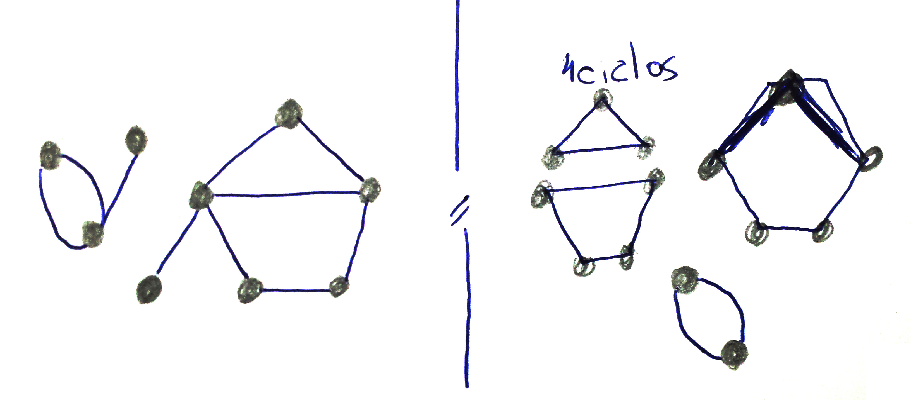

=== O que são árvores e quais suas características?

////
1. *Entender* o que é uma árvore e suas características básicas,
*reconhecendo* e *descrevendo* características de árvores apresentadas.
(Efetivo/factual)
////

////
.Elementos de organização prévia

- Papel, lápis e borracha
- caderno-arvore.asciidoc
- Internet, busca por "graphviz online". 
Ex: http://sandbox.kidstrythisathome.com/erdos/
http://www.webgraphviz.com/
http://ashitani.jp/gv/

////

==== Introdução

Nesta seção apresentamos a terminologia relacionada às árvores, e 
os conceitos básicos. 

.Questões a serem respondidas
****
. O que é uma árvore e como ela difere das demais estruturas?
. Como árvores são representadas?
. O que é um nó? 
. Quais as relações (de parentesco) entre os nós?
. Que são folhas, raiz e nós terminais de uma árvore?
. O que é o grau de um nó?
. Qual o nível de um nó?
. Qual o tamanho de uma árvore?
****

==== Conhecimento da Terminologia

===== Árvore

Antes de apresentar a definição formal de uma árvore você terá
a oportunidade elaborar o seu próprio entendimento do que é uma árvore.

.Atividade: O que caracteriza uma árvore? 
____ 

Caso você esteja estudando no computador você pode imprimir a página ou baixar o
https://github.com/edusantana/mergulhando-de-cabeca-na-ead/blob/master/livro/caderno-arvore.asciidoc[caderno digital]  
e escrever nele. 

Na <<fig_construindo_conceito_arvore>> todos os gráficos da parte
superior *são* árvores, e os de baixo *não* são árvores. *Analise* os
gráficos, *tente entender* o que caracteriza uma árvore e *escreva* o
seu entendimento na caixa  a seguir.

////
Adicionar um ditado popular motivacional, como:
Minha avó dizia, quem belisca não petisca.
////

____

image::images/caixa6cm.eps[]

////
.SÃO ÁRVORES
| X     | vértices ligados por uma única aresta | conexo | ciclosless
| Arvore|                                       |        | 
| Arvore|                                       |        | 
| Arvore|                                       |        | 
| Arvore|                                       |        | 
| Arvore|                                       |        | 
| Arvore|                                       |        | 
.NÃO SÃO ÁRVORES
| N     |                                       |        | X
| N     |                                       |        | X
| N     |               X                       |        | 
| N     |               X                       |        | 
| N     |                                       |    X   | 
| N     |                                       |    X   | 
|====

Conceitos que precisam ser mostrados:
- vértices ligados por uma única aresta
- conexo
- não contem ciclos
////

.Ilustrações para elaboração do conceito de árvore
[[fig_construindo_conceito_arvore]]

<<<

////
****
Eu pedi para minha filha fazer este teste e ela escreveu o seguinte:

[quote]
Para ser uma árvore o gráfico não pode ser divido, todas as bolinhas
precisam ter um tracinho nelas. Se tiver uma bolinha se ligando com outra
mais de uma vez, então também não é árvore. E se tiver uma área
fechada, então também não é uma árvore.

Você chegou a uma solução parecida?
****
////

A definição formal de árvore requer relembrar apenas 4 conceitos  de
*((grafos))*, são eles: *vértices, arestas, grafo conexo e
ciclos*.footnote:[Caso você não se lembra destes conceitos, você
poderá inferi-los.]  Utilizando o grafo no lado esquerdo da
<<fig_grafo_exemplo>>, reconheça que ele possui 9 *vértices*
(representados pelas _bolinhas_), e 10 *arestas* (representados pelos
_traços_) ligando os vértices.  Este grafo *não é conexo*, pois existe
um _pedaço_ do grafo que não está ligado aos demais. Por último, neste
grafo existem quatro *ciclos*, que estão evidenciados no lado direito
da figura.

[[fig_grafo_exemplo]]
.Exemplo de Grafo e sua propriedades

.Definição
****
*((Árvore))* é um ((grafo)) que:

[options="compact"]
- Não contem ciclos;
- É conexo;
- E dados dois vértices ligados por uma aresta, não existe outra
aresta que ligue os mesmos vértices;
****

===== Nó ou vértice

.Definição
****
*((Nó))* é qualquer vértice de uma árvore. Todos os vértices de uma árvore
são nós. 
****

Os nós (_plural de nó_) das árvores geralmente possuem _valores_
associados, que são representados dentro deles. Na
<<fig_arvores_com_nos_valorados>> estão apresentados os valores que
cada nó possui. Perceba que não há restrição sobre a repetição ou
ordem dos valores dos nós.

.Árvores com nós e seus respectivos valores
[[fig_arvores_com_nos_valorados]]
image::images/cap2/arvores_com_nos_valorados.pdf[]

===== Aresta

As **((arestas))** são as ligações entre os nós. A
<<fig_arvores_com_arestas_destacadas>> apresenta as mesmas árvores da
<<fig_arvores_com_nos_valorados>>, mas com as arestas destacadas.

.Arestas destacadas nas árvores
[[fig_arvores_com_arestas_destacadas]]
image::images/cap2/arvores_com_arestas_destacadas.pdf[]

==== Elementos específicos

===== Nó Raiz

(((Árvore, raiz)))

A representação usual de árvore indica que existe _nó inicial_,
que aparece no topo da árvore. Este nó é chamade de o *nó raiz*,
ou simplesmente, *raiz* da árvore.  Na <<fig_raizes>> as raizes de
cada árvore estão destacadas.

.Árvores com suas raizes destacadas
[[fig_raizes]]
image::images/cap2/raizes.pdf[scaledwidth="90%"]

===== Pai e Filho

(((Nó, pai))) (((Nó, filho)))

Um nó é considerado *pai* de outro nó se ele possuir uma aresta
conectando com o outro nó abaixo dele. Dizemos que o nó de baixo é
*filho* do nó de cima, seu *pai* (ver <<fig_pais_filhos>>). O nó raiz
e as folhas são casos especiais, a raiz é o único nó que não possui
pai, e as folhas não possuem filhos.

[[fig_pais_filhos]]
.Ilustração das relações de pai e filho entre os nós de uma árvore
image::images/cap2/pais_filhos.pdf[]

===== Folhas ou nós terminais

(((Folha))) (((Nó,terminal)))

Numa árvore, todos os nós que não possuem filhos são chamados 
de *nós terminais* ou *folhas*. A <<fig_folhas_nos_terminais>> destaca
os nós terminais ou folhas da árvore.

[[fig_folhas_nos_terminais]]
.As folhas são os nós terminais -- todos os nós que não possuem filhos.
image::images/cap2/fig_folhas_nos_terminais.pdf[scaledwidth="65%"]

Os nomes *folhas* e *raiz* provém da visualização de uma árvore invertida,
com a raiz em cima e as folhas em baixo, como indicado na <<fig_folhas_raiz>>.

[[fig_folhas_raiz]]
.Numa árvore o nó de cima é a raiz e nós de baixo são as folhas, ou nós terminais.
image::images/cap2/fig_folhas_raiz.pdf[scaledwidth="65%"]

==== Conhecimento de detalhes

===== Nível de um nó

(((Nó, Nível)))

O *nível* de um nó pode ser entendido como o seu nível de profundidade
na árvore. O primeiro nó, a raiz, pertence ao nível 0, os seus filhos
pertencem ao nível 1, os filhos de seus filhos ao nível 2 e assim por
adiante, até às folhas.

Na <<fig_niveis_nos>>, o nó em destaque pertence ao nível 4.

[[fig_niveis_nos]]
.Demonstração dos níveis de uma árvore, o nó em destaque possui nível 4.
image::images/cap2/niveis_nos.pdf[scaledwidth="65%"]

===== Grau de um nó

(((Nó, Grau)))

O *grau* de um nó corresponde a quantidade de filhos que ele possui.

Por exemplo, na <<fig_grau_no>> temos dois nós de grau 2, o nó A tem
grau 4, o nó B tem grau 3 e o restante tem grau 1.

[[fig_grau_no]]
.Árvore indicando os graus dos nós: R=2, B=3 e A=4.
image::images/cap2/grau_no.pdf[scaledwidth="40%"]

===== Grau de uma árvore

(((Árvore, Grau)))

O *grau de uma árvore* equivale ao maior grau de todos os seus nós.
Por exemplo, o grau da árvore na <<fig_grau_no>> é *4* e da árvore da
<<fig_niveis_nos>> é *2*.

===== Caminho da raiz até um nó

O *caminho* de um nó corresponde ao sub-grafo formado a partir da
raiz até chegar ao nó.

Na <<fig_caminho>> temos árvores com um nó destacado, e o caminho das
raizes até estes nós. O caminho até um nó também pode ser descrito
informando todos os nós percorridos pelo caminho. O caminho na última
árvore pode ser descrito apenas por *ABCD*.

[[fig_caminho]]
.Caminhos dos nós destacadas
image::images/cap2/caminho.pdf[]

===== Tamanho

(((Árvore, Tamanho)))

O *tamanho* (ou altura) de uma árvore corresponde ao maior nível
dos seus nós mais 1.

Na <<fig_arvore_tamanho>>, da esquerda para direita, os tamanhos das
árvores são respectivamente: 3, 3, 4 e 2.

[[fig_arvore_tamanho]]
.Árvores com suas indicações de tamanho
image::images/cap2/tamanho_arvore.pdf[]

==== Verificando o aprendizado

Nesta seção apresentamos a terminologia relacionada às árvores, e os
alguns conceitos básicos. 

Para que você possa verificar que entendeu os conteúdos apresentados,
recomendo que realize a atividade a seguir e compare sua resposta.

image::images/cap2/verificando-aprendizado-objetivo1.pdf[]

Os dados da árvore (a) já foram preenchidos, agora preencha os dados
da árvore (b):

[cols="1a,1a", frame="none", grip="none"]
|====
| 
*Árvore (a)* + 
Nível de nó: *2* +
Pai do nó: *S* +
Filho(s) do nó: *J* +
Caminho até o nó: *WSY* +
Grau de nó: *1* +
Grau da árvore: *2* +
Tamanho da Árvore: *4* +
Maior folha: *M* +
|
*Árvore (b)* +
Nível de nó:  +
Pai do nó:  +
Filho(s) do nó:  +
Caminho até o nó: +
Grau de nó:  +
Grau da árvore: +
Tamanho da Árvore: +
Maior folha: +

|====

<<<

.Resolução 

Para facilitar a compreensão, as folhas e os nós de maior grau foram
realçados na figura a seguir:

image::images/cap2/verificando-aprendizado-objetivo1-solucao.pdf[]

[cols="1a,1a", frame="none"]
|====
|
*Árvore (a)* +
Nível de nó: 2 +
Pai do nó: S +
Filho(s) do nó: J +
Caminho até o nó: WSY +
Grau de nó: 1 +
Grau da árvore: 2 +
Tamanho da Árvore: 4 +
Maior folha: M +
|
*Árvore (b)* +
Nível de nó: 1 +
Pai do nó: G +
Filho(s) do nó: C,T,H +
Caminho até o nó: GN +
Grau de nó: 3 +
Grau de árvore: 4 (grau do nó C) +
Tamanho da Árvore: 5 +
Maior folha: T +

|====

.Certifique-se de ter compreendido todos os conteúdos antes de prosseguir
[NOTE]
--
Depois de realizar a atividade e verificar as respostas 
comentadas, você está confiante que compreendeu os assuntos apresentados? 

Caso você ainda tenha alguma dúvida, releia as seções relacionadas
ou busque outras fontes (como as video aulas
http://youtu.be/iLvpaqAoVD8 e http://youtu.be/U7IiLJlMfnU).

Certifique-se de ter compreendido todos os conteúdos antes de
prosseguir, eles são essenciais para a compreensão do
restante do capítulo.
--

